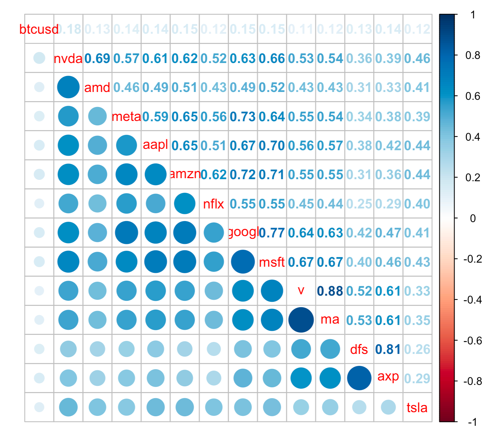
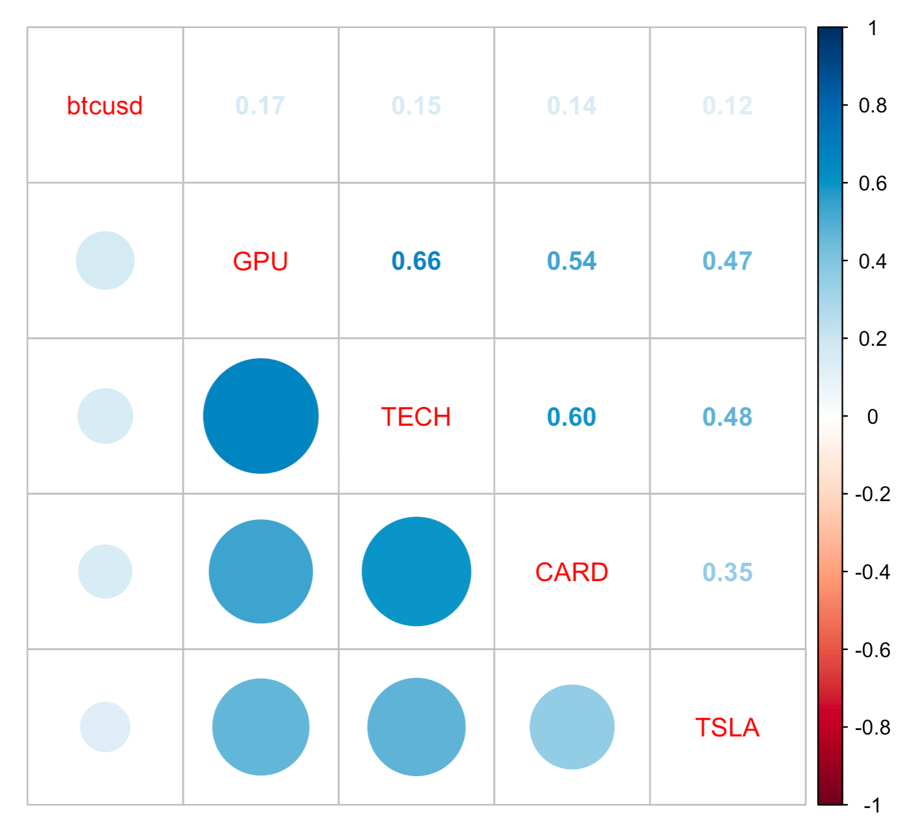
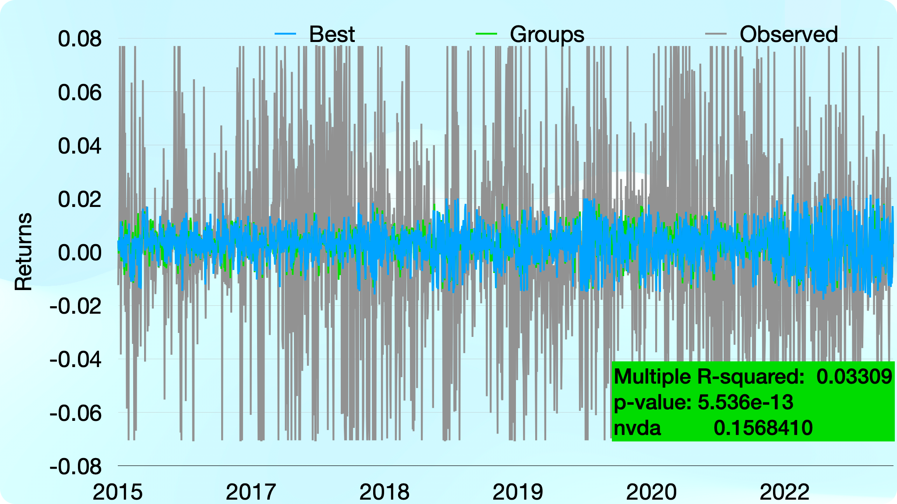

# Bitcoin price prediction
### Keynote presentation: [HERE](https://www.youtube.com/watch?v=lG2Rm_B1u7E)


## Objective
The project's objective was to find a multiple regression model that could predict the price of the cryptocurrency bitcoin.

## Dataset
The dataset consists of daily (without weekends & holidays) prices in U.S. dollars of bitcoin, stock prices of the leading global manufacturers of GPUs (NVIDIA & AMD), Big Tech companies (Alphabet, Amazon, Meta, Apple, Microsoft & Netflix), payment-processing corporations (Visa, MasterCard, Discovery & 
American Express), and Tesla stock prices.
### Source & scope
The dataset was prepared with the use of Google Finance. It starts from 11/19/2015 till 12/30/2022.
### Operations on the dataset
Skewed data were normalized by use of log transformation. The winsorization method was conducted in order to deal with possible outliers.

Correlation plot considering all features.
## Models
The first model consists of the price of bitcoin against all other stock prices. The second one: bitcoin against four groups. Each of the groups covers the average stock price of the group participant. So, for example, the `TECH` group has the mean price of Big Tech companies: Alphabet, Apple, Meta, Amazon, Netflix & Microsoft.

Correlation plot regarding this model.

## Method
Multiple linear regression has been used in this project. Choosing model was conducted using a stepwise algorithm implemented in R language. 
## Results
The best model is the one that was chosen by the stepwise algorithm that
consists of:
```
btc ~ nvda + amzn + v + axp
```
in which `nvda` has the lowest p-value.

Final plot: residuals vs. fitted

Summing up, neither of the models provides satisfying results to be used in practice -- no significant p-value and meager R-squared value are one of the reasons for this statement. 

## Files
- bitcoin-price-prediction.R
- dataset.xlsx

### **bitcoin-price-prediction.R**
This is the project's main file, and the whole R code is covered here. In order to be usable, the following packages should be loaded:
```
library(DescTools)
library(ggplot2)
library(dplyr)
library(Hmisc)
library(pastecs)
library(corrplot)
library(ppcor)
library(readxl)
library(forecast)
```
 ### **dataset.xlsx**
This is the dataset of the project. 

<sub>This work is part of my exam in Financial Data Science @ the University of Pavia, Italy.</sub>